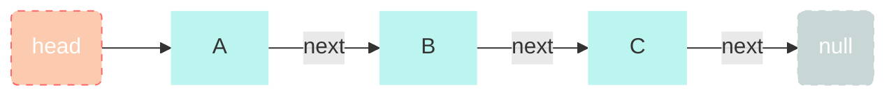
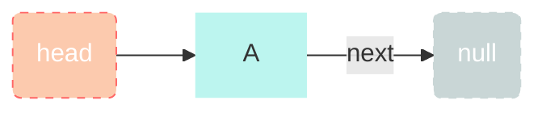
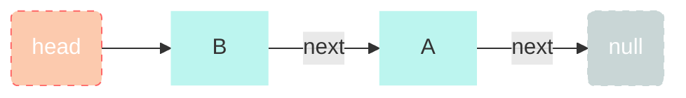
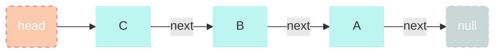
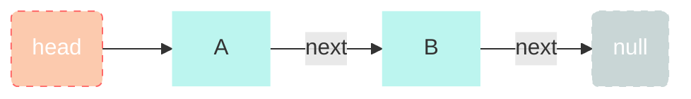
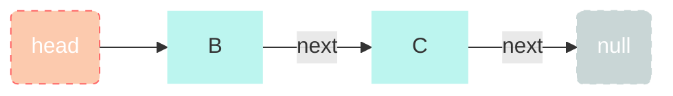

# Explaination

### A LinkedList

```python
class Node:
    def __init__(self, value, next=None):
        self.value = value
        self.next = next
        
class LinkedList:
    def __init__(self):
        self.head = None
```



### Stack (LIFO) - last in first out

```python
def push(self, value):
        if self.head is None:
            self.head = Node(value)
        else:
            newNode = Node(value)
            newNode.next = self.head
            self.head = newNode
            
def pop(self):
        if self.head is None:
            return None
        else:
            popped = self.head.value
            self.head = self.head.next
            return popped
```

##### push A



##### push B



##### push C



##### pop() -> C


##### pop() -> B


### Queue(FIFO) - first in first out

```python
def push(self, value):
        newNode = Node(value)
        if self.head is None:
            self.head = Node(value)
        else:
            current = self.head
            while current.next:
                current = current.next
            current.next = newNode
def pop(self):
        if self.head is None:
            return None
        else:
            popped = self.head.value
            self.head = self.head.next
            return popped
```

##### push A


##### push B



##### push C


##### pop() -> A



##### pop() -> B


